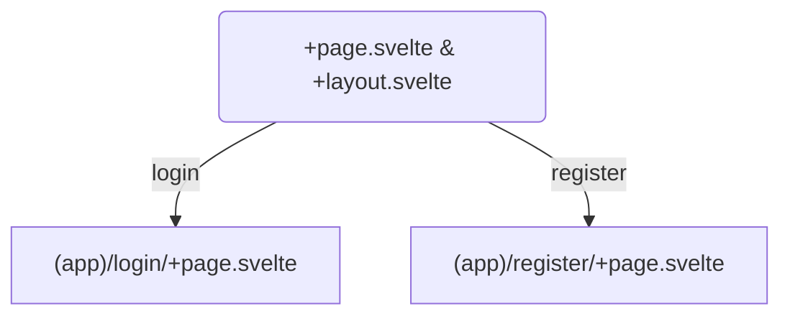
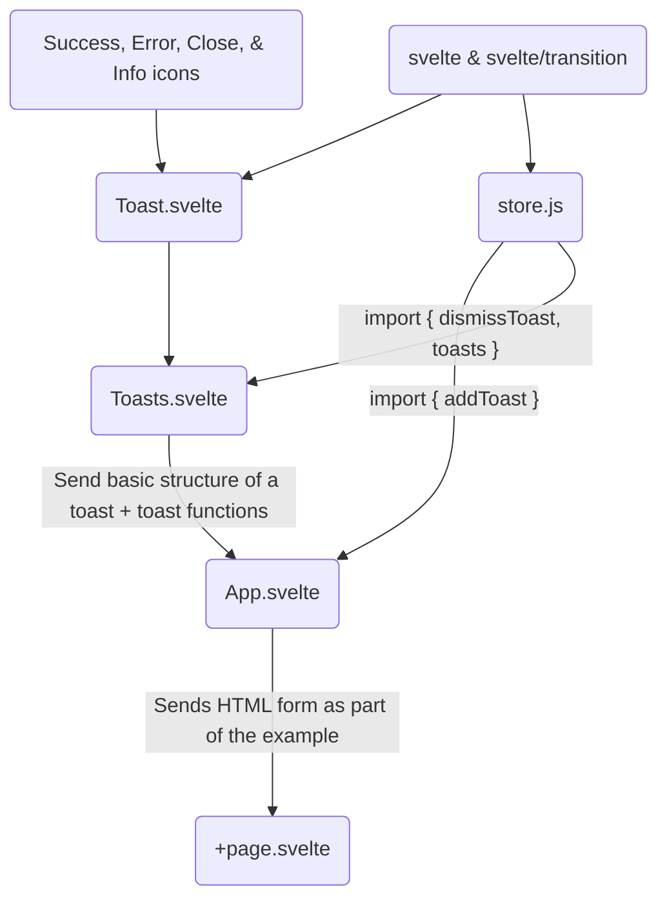

## Svelte Layout Hierarchy


## Toasts Hierarchy
This is a map of how toasts in the Svelte dev example works. In a way, it shows how information is transferred and transformed from **simple Svelte-based icons and transitions** to **toast notifications** complete with timeouts and dismiss buttons.

### What I did to make this map
In order to allow the sample Svelte toast to work in my local machine, I imported App.svelte into the +page.svelte file of my register directory to print its contents into the page. 

From there, I traced the imports while taking notes on what each file did and the underlying logic over the separation of their contents. The flow of arrows represent the transfer of functions (if not the whole .svelte file module). The map traces backwards up to what functions that seem like the standard library for Svelte. However, I am not sure whether these really are part of the standard "library", or whether it can really be called a library at all.

### Descriptions of each .svelte file
**Toast.svelte**
- This file consists of what seems like **initial styling configurations** for each toast. It defines the width and and initial conditions of for appearance-related settings (like whether the toast is dismissible or not). Designs seem to be written in a language called "postcss". Lastly, it borrows assets from what I believe to be the standard Svelte library and icon images made from .svelte files.
**store.js**
- Weirdly enough, this is a JavaScript file among Svelte files. It borrows the "writable" function from what I think is part of the Svelte standard library. This file **contains self-contained functions for creating, tracking, and dismissing each toast generated by the app**. Other .svelte files seem to rely heavily on this file.
**Toasts.svelte**
- This file **contains positioning information** for all toasts. It seems to **act as a sort of an *assembler* or *compiler* to the whole toast system** because it gathers appearance and functionality configurations from Toast.svelte and store.js to create what seems to be a fully-functional toast.
**App.svelte**
- If run on the main Svelte documentations website, App.svelte is the file that shows you everything you see. Here, **it borrows the "addToast" function from store.js to create a toast instance**. This function also stores the configuration information for required by the addToast function to choose whether it prints a success, error, or info toast.

## Conclusion
I have yet to test this idea, so take with a grain of salt. I think **you can make a new toast by importing the whole Toasts.svelte file and the addToast function from store.js**. The addToasts function requires the following variables to work:
- message - for the message that shows up on the toast.
- type - whether it is a success, error, or info toast.
- type - I am not sure what this does yet.
- dismissible - set as true (with close button) or false (no close button).
- timeout - how long it takes until the toast disappears without user action (set to 0 for never).

And to call the addToast function, use the following:
```js
addToast({ message, type, dismissible, timeout })}
```


## Requirements
- [ ] Use a writable store to store user data, toast data, and currently logged in user.

- [ ] Use `goto` to redirect to a page

- [ ] Toast Notification must accept a message and a type

- [ ] Use Pick, Omit to create a new type from the given base Types below.

- [ ] Additional types are, ToastCreate, UserRegister, UserLogin

- [ ] `/dashboard` will redirect users to login if there is no user logged in.

- [ ] A `GenericMessage` type, with status and message properties. Should be the default returns from Login,logout,Register